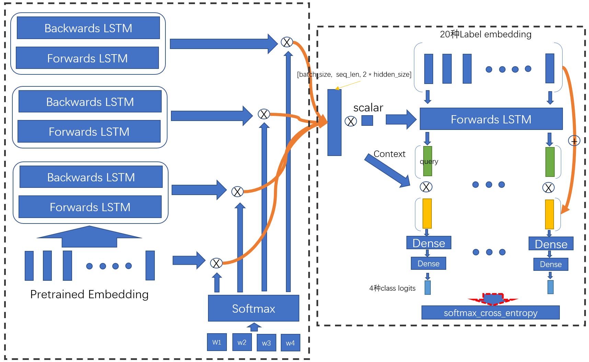
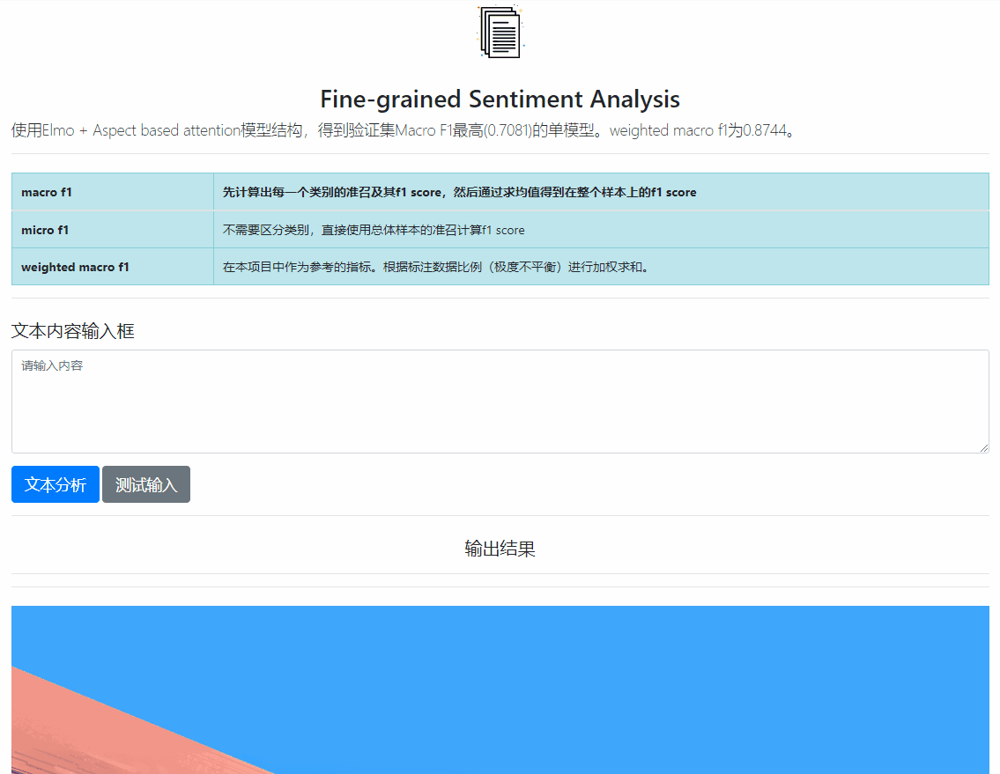
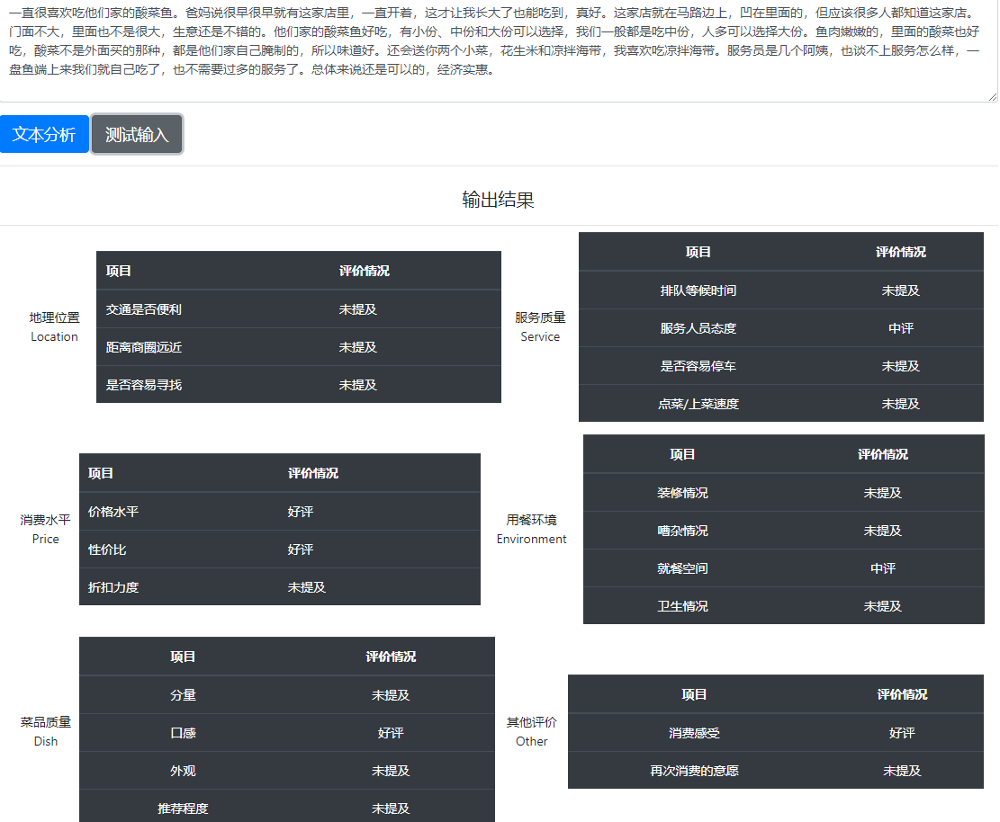

# 评论细粒度情感分类

### 背景

在自然语言处理中，有一个常见的问题就是对客户的评价进行分析。 这些用户评论中，包含了大量的有用信息，例如情感分析，或者相关事实描述。 例如:

>  “味道不错的面馆，性价比也相当之高，分量很足～女生吃小份，胃口 小的，可能吃不完呢。环境在面馆来说算是好的，至少看上去堂子很 亮，也比较干净，一般苍蝇馆子还是比不上这个卫生状况的。中午饭 点的时候，人很多，人行道上也是要坐满的，隔壁的冒菜馆子，据说 是一家，有时候也会开放出来坐吃面的人。“

首先情感是正向的，除此之外我们还能够进行知道这个的几个事实描述：1. 性价比比较高； 2. 装修比较好； 3. 分量足。

### 数据

输入一句话，输出是这句话对于以下6大类，20小类进行打标，对于每个小类而言，都会有`< 正面情感, 中性情感, 负面情感, 情感倾向未提及 > `这4个类别。

标注训练数据中，`< 正面情感, 中性情感, 负面情感, 情感倾向未提及 >`  分别对应与` (1, 0, -1, -2)`

- 位置: location

> 1. 交通是否便利(traffic convenience)
> 2. 距离商圈远近(distance from business district)
> 3. 是否容易寻找(easy to find)

- 服务(service)

> 1. 排队等候时间(wait time)
> 2. 服务人员态度(waiter’s attitude)
> 3. 是否容易停车(parking convenience)
> 4. 点菜/上菜速度(serving speed)

- 价格(price)

> 1. 价格水平(price level)
> 2. 性价比(cost-effective)
> 3. 折扣力度(discount)

- 环境(environment)

> 1. 装修情况(decoration)
> 2. 嘈杂情况(noise)
> 3. 就餐空间(space)
> 4. 卫生情况(cleaness)

- 菜品(dish)

> 1. 分量(portion)
> 2. 口感(taste)
> 3. 外观(look)
> 4. 推荐程度(recommendation)
> 5. 其他(others)
> 6. 本次消费感受(overall experience)
> 7. 再次消费的意愿(willing to consume again)

> ##### 示例
>
> “味道不错的面馆，性价比也相当之高，分量很足～女生吃小份，胃口小的，可能吃不完呢。环境在面馆来说算是好的，至少看上去堂子很亮，也比较干净，一般苍蝇馆子还是比不上这个卫生状况的。中午饭点的时候，人很多，人行道上也是要坐满的，隔壁的冒菜馆子，据说是一家，有时候也会开放出来坐吃面的人。“
>
> > 标签为：
> >
> > - 交通是否便利(traffic convenience) -2
> > - 距离商圈远近(distance from business district) -2
> > - 是否容易寻找(easy to find) -2
> > - 排队等候时间(wait time) -2
> > - 服务人员态度(waiter’s attitude) -2
> > - 是否容易停车(parking convenience) -2
> > - 点菜/上菜速度(serving speed) -2
> > - 价格水平(price level) -2
> > - 性价比(cost-effective) 1
> > - 折扣力度(discount) -2
> > - 装修情况(decoration) 1
> > - 嘈杂情况(noise) -2
> > - 就餐空间(space) -2
> > - 卫生情况(cleaness) 1
> > - 分量(portion) 1
> > - 口感(taste) 1
> > - 外观(look) -2
> > - 推荐程度(recommendation) -2
> > - 消费感受(overall experience) 1
> > - 再次消费的意愿(willing to consume again) -2

### Final Model




### Evaluation

单模型 macro f1 score -- 0.70，以此为标准

fasttext模型，尝试对所有标签联合分类，20种类型标签分别多分类，以及分为80个二分类任务。通过auto tuning找到相对较好的模型参数。模型的precision和f1相比于以下使用的elmo based模型，每种label最少低了0.02。

elmo + aspect based attention模型，尝试了fasttext中所有的loss，以及只有在tensorflow中才能进行的80个multi class softmax loss，这在pytorch的实现中是是做不了的（但是这已经不是softmax原本定义的使用模式了），使用这种loss相比其他loss提升了0.1%左右的f1。另外focal loss在此任务中的表现一般，f1没有提高。

albert模型，尝试从[CLS]token接全连接层进行分类。分别使用了albert tiny和albert large，albert tiny在44000步左右，eval loss相对稳定。f1仅为0.45。  albert large由于训练时长太长，没有训练到收敛。但是在前6000步，loss相对albert tiny没有明显的提高。

此任务的长文本特性和多标签分类特性，是导致albert模型效果较差的主要原因。下游任务可以更复杂一些，比如bert接上textcnn的结果最好达到[0.68的f1](https://github.com/brightmart/sentiment_analysis_fine_grain)。前提是有充足的计算资源，否则训练时长会很长。


对数据的处理，有两个方面。一个是文本清洗，过度的文本清洗在此任务中反而会使f1稍稍降低（本项目实验中），只对文本进行了明显的噪声清洗。一个每种label的类别极度不平衡。会出现90000对2000这样45：1的样本比例。

[文本增强](https://github.com/RacleRay/TextClassification/tree/master/EDA_nlp)考虑随机替换，交换，删除等。但是由于有多重类型的label，每次针对某一个label数据增强，多次增强之后，很容易导致训练过程过拟合。训练时仅仅在训练初期使用了增强数据2个epoch，然后切换为未增强的数据。


训练末期，固定embedding部分，包括elmo，只对classifier部分进行微调，f1提高0.003。

模型训练没有使用预训练的elmo模型，而是使用elmo结构。没有尝试使用预训练的elmo模型，使用之后也许会有效果的提升。


最终模型 macro f1为0.708，如果考虑不平衡数据比例，得到带权f1为0.874。如果集成多种模型，应该会有泛化能力的提升。此任务的测试集较小，如果有更多的标注测试样本，应该能得到更准确的模型评价结果。


### 部署模型

采用tensorflow serving docker进行模型部署。通过save_model导出带signature的模型文件，客户端可以从grpc和rest api访问模型。


### 效果



---




### Structure
```
Fine-grained_TextClassification
|
├─ README.md
├─ dataset.py
├─ data_loader.py
├─ data_process.py
├─ elmo.py
├─ elmo_run.py
├─ elmo_utils.py
├─ weight_drop_lstm.py
├─ grpc_infer.py
├─ multi_class_base.py
├─ multi_class_cnn.py
├─ app.py
|
├─ Build inference model.ipynb
├─ start_tf_serving.ps1
├─ start_tf_serving.sh
├─ run_app.sh
├─ labels.txt
|
├─ fasttext.ipynb
├─ fasttext_local.ipynb
|
├─ output
│  ├─ 1
│  │  └─ best_eval-base.zip
│  ├─ 2
│  │  └─ best_eval-focal_smooth.zip
│  ├─ data_origin.zip
│  ├─ elmo_ema_data_modified-20200605T082245Z-001.zip
│  └─ elmo_origin_loss_fix_at_best
|
├─ run_log
│  ├─ albert的log在Albert文件夹下.txt
│  ├─ preprocess.sh
│  ├─ run_base.ipynb
│  ├─ run_log_1.ipynb
│  ├─ run_log_2.ipynb
│  └─ run_log_3.ipynb
|
├─ serving
│  └─ v1
│     └─ 001
│        ├─ saved_model.pb
│        └─ variables
│           ├─ variables.data-00000-of-00002
│           ├─ variables.data-00001-of-00002
│           └─ variables.index
|
├─ static
|  └─ ...
├─ templates
│  └─ index.html
│
├─ Albert
│  ├─ base_runner.py
│  ├─ base_utils.py
│  ├─ global_config.py
│  ├─ main.py
│  ├─ models
│  │  ├─ awd_lstm.py
│  │  ├─ multi_class_cnn.py
│  │  ├─ multi_class_rnn.py
│  │  ├─ multi_label_linear.py
│  │  ├─ multi_label_softmax.py
│  │  └─ __init__.py
│  ├─ outputs
│  │  └─ checkpoint-6000
│  ├─ outputs_tiny
│  │  ├─ best_model
│  │  │  ├─ pytorch_model.bin
│  │  │  └─ ...
│  │  ├─ training_progress_scores.csv
│  │  └─ training_progress_scores_pre.csv
│  ├─ run_albert_1.ipynb
│  ├─ run_albert_2.ipynb
│  ├─ run_multi_class_cnn.py
│  ├─ run_multi_label_linear.py
│  ├─ xbert_cnn_runner.py
│  ├─ xbert_multi_label_linear_runner.py
│  ├─ xbert_rnn_runner.py
│  └─ __init__.py
|
├─ data
│  ├─ albert
│  │  └─ ...
│  ├─ code_analysis
│  │  ├─ EDA.ipynb
│  │  ├─ EDA_nlp
│  │  │  └─ stopwords.txt
│  │  ├─ label_to_array.ipynb
│  │  ├─ new_cilin.txt
│  │  ├─ stopwords.txt
│  │  └─ 注意文件路径修改+原始数据在origin文件夹下.txt
│  ├─ origin
│  │  ├─ testa_没有正确label来测试结果
│  │  ├─ testb_没有正确label来测试结果
│  │  ├─ trainingset
│  │  │  ├─ augment_data
│  │  │  │  └─ augment_data.zip
│  │  │  ├─ class_weights.bin
│  │  │  ├─ pretrain_data
│  │  │  ├─ sentiment_analysis_trainingset.csv
│  │  │  └─ sentiment_analysis_trainingset_annotations.docx
│  │  └─ validationset
│  │     ├─ sentiment_analysis_validationset.csv
│  │     └─ sentiment_analysis_validationset_annotations.docx
│  ├─ data_aug.csv
│  ├─ embedding.txt
│  ├─ labels.txt
│  ├─ testa.json
│  ├─ train.json
│  ├─ train_not_aug.json
│  ├─ validation.json
│  └─ vocab.txt
|
└─ test.py
```